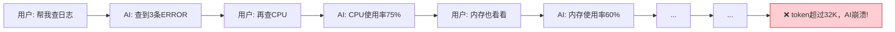
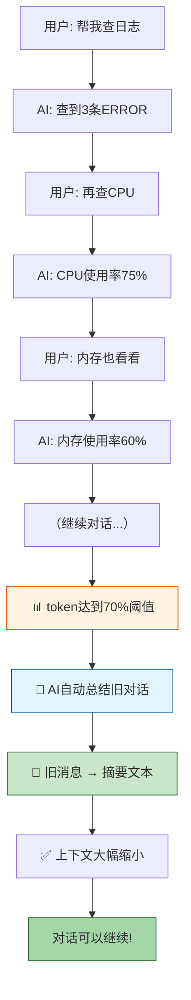

# 更新日志：对话上下文自动压缩

> **一句话总结**：当对话越来越长、快要超出 AI 模型的"记忆容量"时，系统会自动用 AI 把前面的对话总结成一段摘要，只保留摘要 + 最近的几句话，从而让对话可以无限继续下去。

---

## 📚 目录

1. [背景：为什么需要这个功能？](#1-背景为什么需要这个功能)
2. [改造前后对比](#2-改造前后对比)
3. [核心概念讲解](#3-核心概念讲解)
4. [工作原理（图文详解）](#4-工作原理图文详解)
5. [改动文件清单](#5-改动文件清单)
6. [代码详解](#6-代码详解)
7. [配置说明](#7-配置说明)
8. [常见问题](#8-常见问题)

---

## 1. 背景：为什么需要这个功能？

### 1.1 什么是"上下文窗口"？

每个 AI 大模型都有一个"记忆容量"限制，叫做**上下文窗口（Context Window）**。本项目使用的 `qwen-max` 模型，上下文窗口是 **32,768 个 token**。

> **什么是 token？**
> token 是 AI 处理文本的最小单位。对于中文，大约 1 个汉字 = 1.5~2 个 token；对于英文，大约 1 个单词 = 1.3 个 token。
>
> 举个例子："你好世界" 大约等于 4~6 个 token。

### 1.2 改造前的问题



**问题**：
- 每说一句话，对话历史就会多几条消息
- 消息越积越多，token 数不断增长
- 当 token 数超过 32,768 时，AI 就会"失忆"或直接报错
- 之前的 `trim_messages_middleware`（消息截断函数）虽然定义了，但**从来没有被真正使用过**（死代码）

### 1.3 改造后的方案



---

## 2. 改造前后对比

### 2.1 消息存储对比

**改造前（消息无限堆积）**：

```
┌─────────────────────────────────────────┐
│ 消息1:  SystemMessage("你是助手...")      │
│ 消息2:  HumanMessage("帮我查日志")        │
│ 消息3:  AIMessage("查到3条ERROR...")      │
│ 消息4:  HumanMessage("查CPU")             │
│ 消息5:  AIMessage("CPU 75%...")           │
│ 消息6:  HumanMessage("内存呢")            │
│ 消息7:  AIMessage("内存60%...")           │
│ 消息8:  HumanMessage("再查磁盘")          │
│ 消息9:  AIMessage("磁盘80%...")           │
│ 消息10: HumanMessage("网络呢")            │
│ 消息11: AIMessage("网络正常...")          │
│ ...                                      │
│ 消息50: ❌ 超出32K tokens，AI崩溃         │
└─────────────────────────────────────────┘
```

**改造后（自动压缩）**：

```
压缩前（12条消息，~28,000 tokens）：
┌─────────────────────────────────────────┐
│ System: "你是助手..."                    │
│ User: "帮我查日志"                       │
│ AI: 调用 search_topic...                 │
│ Tool: 返回 topic_id=xxx                  │
│ AI: "查到3条ERROR日志..."               │
│ User: "查CPU"                            │
│ AI: 调用 query_cpu...                    │
│ Tool: 返回 CPU数据                       │
│ AI: "CPU使用率75%..."                    │
│ User: "内存呢"                           │
│ AI: 调用 query_memory...                 │
│ Tool: 返回 内存数据                      │
└─────────────────────────────────────────┘
           │
           │ 🤖 触发压缩（token >= 70%）
           ▼
压缩后（6条消息，~5,000 tokens）：
┌─────────────────────────────────────────┐
│ System: "你是助手..."                    │
│ Human: "[历史对话摘要]                    │
│  用户先查询了日志，发现3条ERROR；         │
│  然后查询了CPU，使用率75%；              │
│  接着查询了内存，使用率60%..."           │
│ User: "内存呢"                           │
│ AI: 调用 query_memory...                 │
│ Tool: 返回 内存数据                      │
└─────────────────────────────────────────┘
```

### 2.2 架构对比

| 维度 | 改造前 | 改造后 |
|------|--------|--------|
| 消息管理 | 无限堆积，token 越来越多 | 自动监控，超阈值后压缩 |
| 截断方式 | 简单丢弃旧消息（死代码，未启用） | AI 总结旧消息 + 保留最近4条 |
| 降级策略 | 无 | 总结失败时自动回退到简单截断 |
| Token 计数 | 无 | tiktoken 精确计数，回退估算 |
| 集成方式 | 未集成（`trim_messages_middleware` 未被使用） | `create_agent(middleware=[...])` 原生集成 |

---

## 3. 核心概念讲解

### 3.1 三个关键参数

| 参数 | 默认值 | 含义 | 类比 |
|------|--------|------|------|
| `CONTEXT_MAX_TOKENS` | 32768 | AI 的"总记忆容量" | 一个本子的总页数 |
| `CONTEXT_COMPRESSION_THRESHOLD` | 0.7 (70%) | 什么时候开始压缩 | 本子写了70%就开始整理 |
| `CONTEXT_KEEP_RECENT` | 4 | 压缩后保留最近几条消息 | 最近4页不整理，保持原样 |

### 3.2 两个关键角色

1. **ConversationCompressor（对话压缩器）**
   - 负责计算 token 数、判断是否需要压缩、执行总结
   - 类似于一个"自动整理笔记的助手"

2. **CompressionMiddleware（压缩中间件）**
   - 负责在每次 AI 回答之前触发压缩检查
   - 类似于一个"门卫"，每次 AI 要说话前先检查是否需要整理

### 3.3 关键技术

#### tiktoken（Token 计数器）

```python
# tiktoken 是 OpenAI 开源的 token 计数工具
# 它能把文字转换成数字（token），AI 只认识数字

"你好世界"  →  tiktoken  →  [57668, 53978, 49899]  →  3 个 token
"Hello"     →  tiktoken  →  [9906]                →  1 个 token
```

#### LLM 总结（AI 生成摘要）

```
输入：10条历史对话消息（共5000字）
  ↓
调用 qwen-max（temperature=0.3，低温度保证准确）
  ↓
输出：一段简洁摘要（约200字）
"用户查询了日志发现3条ERROR，查询了CPU使用率75%..."
```

---

## 4. 工作原理（图文详解）

### 4.1 完整流程图

```
每次用户发消息
       │
       ▼
┌──────────────────┐
│  pre_model_hook  │  ← CompressionMiddleware
│  (模型调用前触发) │
└──────┬───────────┘
       │
       ▼
┌──────────────────┐
│ count_tokens()   │  计算当前所有消息的 token 总数
│ 用 tiktoken 计数  │
└──────┬───────────┘
       │
       ├─── tokens < 22,400 (70% × 32K) ──→ 不压缩，正常继续
       │
       └─── tokens >= 22,400 ──→ 触发压缩！
                                        │
                                        ▼
                              ┌──────────────────┐
                              │ 消息分组           │
                              │                   │
                              │ ① SystemMessage   │→ 保留
                              │ ② 旧消息(需总结)   │→ 发送给LLM总结
                              │ ③ 最近4条消息     │→ 保留原样
                              └──────┬───────────┘
                                     │
                                     ▼
                              ┌──────────────────┐
                              │ LLM 总结旧消息     │
                              │                   │
                              │ 输入: 8条消息      │
                              │ 输出: 1段摘要      │
                              └──────┬───────────┘
                                     │
                              ┌──────┴───────────┐
                              │ 总结失败？         │
                              │                   │
                              ├─ 成功 ──→ 用摘要替换旧消息
                              └─ 失败 ──→ 简单截断（降级）
                                     │
                                     ▼
                              ┌──────────────────┐
                              │ 重建消息列表       │
                              │                   │
                              │ [SystemMessage]   │
                              │ [摘要HumanMessage] │
                              │ [最近4条消息]      │
                              └──────┬───────────┘
                                     │
                                     ▼
                              ┌──────────────────┐
                              │ 更新 MemorySaver  │
                              │ (持久化压缩结果)   │
                              └──────────────────┘
```

### 4.2 总结提示词

当触发压缩时，系统会用以下提示词让 AI 生成摘要：

```
请将以下对话历史总结为一到两段简洁的摘要。
摘要需要包含：
1. 用户问过的所有问题的要点
2. 助手执行过的关键操作（如调用了什么工具、查到了什么数据）
3. 重要的发现和结论

请直接用中文输出摘要，不要加"对话摘要："等前缀。
```

### 4.3 降级策略

如果 LLM 总结失败（比如网络问题、API 限流等），系统不会崩溃，而是自动回退到**简单截断**：

```
正常流程：  旧消息 → LLM总结 → 摘要文本 → 保留
降级流程：  旧消息 → 直接丢弃 → 只保留系统消息 + 最近消息
```

---

## 5. 改动文件清单

| # | 文件 | 改动类型 | 改动内容 |
|---|------|---------|---------|
| 1 | `pyproject.toml` | 新增依赖 | 添加 `tiktoken>=0.7.0`，用于精确 token 计数 |
| 2 | `.env` | 新增配置 | 添加 3 个环境变量：`CONTEXT_MAX_TOKENS`、`CONTEXT_COMPRESSION_THRESHOLD`、`CONTEXT_KEEP_RECENT` |
| 3 | `app/config.py` | 新增字段 | 添加 3 个配置字段，从环境变量读取 |
| 4 | `app/services/rag_agent_service.py` | **核心改动** | 详见下方代码详解 |
| 5 | `更新日志-对话上下文压缩.md` | 新建文档 | 本文档 |

---

## 6. 代码详解

### 6.1 新增模块：ConversationCompressor（对话压缩器）

位置：`app/services/rag_agent_service.py`，第 45~270 行

```python
class ConversationCompressor:
    """对话上下文压缩器
    
    这是整个功能的核心，负责：
    1. 计算 token 数量
    2. 判断是否需要压缩
    3. 执行 LLM 总结
    4. 重建消息列表
    """
    
    def __init__(self, max_tokens=32768, threshold=0.7, keep_recent=4):
        self.max_tokens = max_tokens      # 32K tokens = qwen-max 窗口
        self.threshold = threshold        # 0.7 = 70% 时触发
        self.keep_recent = keep_recent    # 保留最近 4 条消息
    
    def count_tokens(self, messages) -> int:
        """计算消息的 token 数"""
        # 优先使用 tiktoken 精确计数
        # 如果 tiktoken 不可用，使用字符估算
        # 中文：1 字符 ≈ 1.5 token
        # 英文：4 字符 ≈ 1 token
    
    async def compress(self, messages) -> dict | None:
        """执行压缩的主方法"""
        # 1. 检查 token 数是否达到阈值
        # 2. 分离系统消息、旧消息、最近消息
        # 3. 调用 LLM 总结旧消息
        # 4. 重建消息列表
        # 5. 失败时降级为简单截断
```

### 6.2 新增模块：CompressionMiddleware（压缩中间件）

位置：`app/services/rag_agent_service.py`，第 273~307 行

```python
class CompressionMiddleware:
    """上下文压缩中间件
    
    这是 LangChain create_agent 的 middleware 协议实现。
    每次 AI 模型被调用前，abefore_model 方法会被自动触发。
    """
    
    def __init__(self):
        self.compressor = ConversationCompressor(
            max_tokens=config.context_max_tokens,
            threshold=config.context_compression_threshold,
            keep_recent=config.context_keep_recent,
        )
    
    async def abefore_model(self, state, runtime=None):
        """模型调用前的钩子函数
        
        LangChain 会在每次调用 LLM 之前自动调用这个方法。
        """
        messages = state.get("messages", [])
        return await self.compressor.compress(messages)
```

### 6.3 修改：_initialize_agent（集成中间件）

位置：`app/services/rag_agent_service.py`，第 330 行

```python
async def _initialize_agent(self):
    # ... 工具加载代码不变 ...
    
    # 【新增】创建上下文压缩中间件
    compression_middleware = CompressionMiddleware()
    
    # 【修改】将中间件传入 create_agent
    self.agent = create_agent(
        self.model,
        tools=all_tools,
        checkpointer=self.checkpointer,
        system_prompt=self.system_prompt,
        middleware=[compression_middleware],  # ← 新增参数
    )
```

### 6.4 删除：trim_messages_middleware（死代码）

原来的 `trim_messages_middleware` 函数（约 37 行）已被删除，因为它：
- 从未被连接到 agent 中（定义了但没使用）
- 只能简单截断，不能智能总结

---

## 7. 配置说明

### 7.1 环境变量（.env）

```bash
# 上下文压缩配置
# qwen-max 的上下文窗口大小（单位：tokens）
CONTEXT_MAX_TOKENS=32768

# 压缩触发阈值（当 token 使用量到达此比例时触发压缩）
# 0.7 表示使用到 70% 时触发，即 32768 × 0.7 = 22,938 tokens
CONTEXT_COMPRESSION_THRESHOLD=0.7

# 压缩后保留的最近消息条数
# 4 条 = 大约 2 轮完整对话（用户问 + AI答 = 1轮）
CONTEXT_KEEP_RECENT=4
```

### 7.2 配置调优建议

| 场景 | 建议配置 | 理由 |
|------|---------|------|
| 对话以短问答为主 | `THRESHOLD=0.8, KEEP_RECENT=6` | 每条消息短，可以多保留一些 |
| 对话包含大量数据分析 | `THRESHOLD=0.6, KEEP_RECENT=4` | 分析结果内容多，早点压缩 |
| 需要保留更多上下文 | `THRESHOLD=0.5, KEEP_RECENT=8` | 宁愿频繁压缩，也要多保留原始消息 |
| 使用更大的模型窗口 | `MAX_TOKENS=131072` | 如果切换到 qwen-max-128k 等更大窗口模型 |

---

## 8. 常见问题

### Q1: 压缩后 AI 会不会"忘记"之前说过的话？

**A**: 会丢失细节，但会保留要点。就像你看完一本书后只能记住大概内容，记不住每一页的具体文字。摘要包含了关键信息：
- 用户问过什么
- AI 做了什么操作
- 发现了什么结果

所以 AI 仍然知道对话的"主线"，只是记不住每个细节。

### Q2: 压缩需要额外花钱吗？

**A**: 是的，每次压缩需要额外调用一次 LLM（生成摘要）。但由于使用的是同一个模型（qwen-max），且总结任务很简单（只有几百字的输入），费用非常低，大约每次压缩几厘钱。

### Q3: 如果 tiktoken 没有安装怎么办？

**A**: 系统会自动降级到**字符估算**方式：
- 中文字符 ≈ 1.5 token
- 英文字符 ≈ 0.25 token

虽然不如 tiktoken 精确，但足以判断是否需要压缩。当然，建议还是安装 tiktoken（已经添加到 `pyproject.toml` 中）。

### Q4: 压缩过程中对话会卡住吗？

**A**: 会有短暂的等待（LLM 生成摘要需要 1~3 秒），但只在第一次触发压缩时发生。后续对话不会每次都压缩（因为压缩后 token 数大幅减少，距离下次触发还有很长的距离）。

### Q5: 我能关闭这个功能吗？

**A**: 把 `CONTEXT_COMPRESSION_THRESHOLD` 设置为 `1.0` 即可（100% 才触发，实际上永远不会触发）。

### Q6: 为什么选择 70% 作为阈值，而不是 80% 或 90%？

**A**: 因为：
- 压缩本身需要额外的 token（摘要文本 + 提示词）
- 新对话还需要空间来生成回复
- 70% 给压缩结果和新对话留了 30% 的余量（约 9,800 tokens），非常安全

### Q7: 这个功能对 AIOps 诊断流程（Plan-Execute-Replan）也生效吗？

**A**: 不，目前只对**对话功能**（`/api/chat` 和 `/api/chat_stream`）生效。AIOps 诊断流程使用的是不同的 Agent（`app/services/aiops_service.py`），暂未集成此功能。如有需要可以后续添加。

---

## 📊 总结

| 项目 | 说明 |
|------|------|
| 功能名称 | 对话上下文自动压缩 |
| 触发条件 | token 使用量 ≥ 70% × 32,768 (≈ 22,938 tokens) |
| 压缩方式 | LLM 总结旧消息 → 摘要文本替换 |
| 保留策略 | 系统消息 + 摘要 + 最近 4 条消息 |
| 降级策略 | 总结失败 → 简单截断（保留最近消息） |
| 性能影响 | 首次压缩额外 1~3 秒延迟 |
| 费用影响 | 每次压缩约几分钱（LLM 总结调用） |
| 改动文件 | 4 个（pyproject.toml, .env, config.py, rag_agent_service.py） |
| 新增文件 | 1 个（本文档） |
