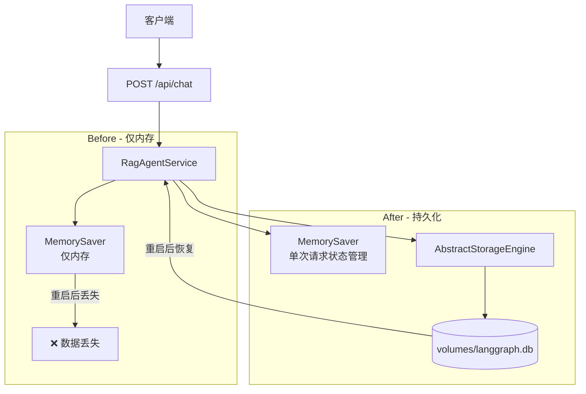
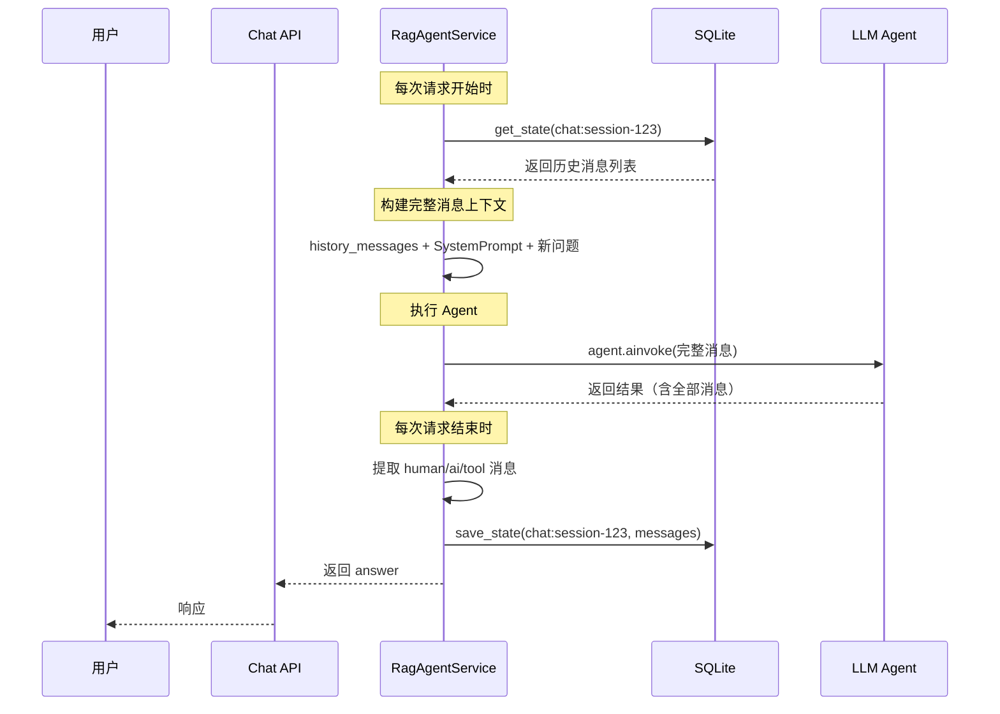

# RAG Agent 对话持久化方案

## 1. 背景分析

### 当前架构现状

| 组件 | 存储方式 | 是否持久化 | 存储介质 |
|------|---------|-----------|---------|
| AIOps 服务 | `AbstractStorageEngine` → `SQLiteStorageEngine` | ✅ 是 | `volumes/langgraph.db` |
| RAG Agent 聊天 | `MemorySaver`（内存检查点） | ❌ 否 | 只有内存，重启丢失 |

### 问题

目前普通对话（chat）的对话历史只保存在内存中 (`rag_agent_service.py:408`)：

```python
self.checkpointer = MemorySaver()  # 仅内存，重启后丢失
```

而 AIOps 服务已经通过 `AbstractStorageEngine` 接口实现了完整的状态持久化。

## 2. 设计方案

### 核心策略

**复用现有的 `AbstractStorageEngine`**，在 `RagAgentService` 中实现与 AIOps 风格一致的持久化模式。

### 关键设计决策

#### 决策 1：存储 key 隔离

使用 `chat:{session_id}` 作为存储 key，与 AIOps 的 `{session_id}` 区分，避免数据冲突。

```
SQLite sessions 表:
┌──────────────────────┬──────────────────────────────────┐
│ thread_id            │ state_json                       │
├──────────────────────┼──────────────────────────────────┤
│ default              │ {"input":"...", "plan":[...]}     │  ← AIOps
│ chat:session-123     │ {"messages":[...]}                │  ← Chat (新增)
│ chat:session-456     │ {"messages":[...]}                │  ← Chat (新增)
└──────────────────────┴──────────────────────────────────┘
```

#### 决策 2：消息序列化格式

将 LangChain `BaseMessage` 对象序列化为纯 JSON 字典，避免直接 pickle 二进制：

```json
{
  "messages": [
    {"type": "human", "content": "你好", "timestamp": "2026-06-21T14:30:00"},
    {"type": "ai", "content": "你好！有什么可以帮助你的？", "timestamp": "2026-06-21T14:30:05"},
    {"type": "tool", "content": "{...}", "name": "search_log", "timestamp": "..."}
  ]
}
```

#### 决策 3：对 MemorySaver 的处理

保留 `MemorySaver`（不删除），因为 `create_agent` 依赖它进行单次请求内的状态跟踪（工具调用等）。但**不再依赖它来恢复跨请求的历史消息**——每次请求都从 SQLite 加载完整历史并手动传入。

## 3. 修改计划

### 文件修改清单

| 文件 | 操作 | 说明 |
|------|------|------|
| `app/services/rag_agent_service.py` | 修改 | 核心修改，添加持久化逻辑 |
| `app/api/session.py` | 修改 | 兼容 Chat 会话的展示 |

### 3.1 `rag_agent_service.py` 修改详情

#### 步骤 1：引入存储引擎

```python
from app.core.storage_factory import get_storage_engine
```

#### 步骤 2：`__init__` 中初始化存储引擎

```python
def __init__(self, streaming: bool = True):
    ...
    self.storage = get_storage_engine()  # 新增：共享存储引擎
    self.checkpointer = MemorySaver()     # 保留：用于单次请求状态管理
```

#### 步骤 3：添加辅助方法

```python
def _chat_key(self, session_id: str) -> str:
    """生成聊天专用的存储 key，与 AIOps 隔离"""
    return f"chat:{session_id}"

def _serialize_messages(self, messages: list) -> list[dict]:
    """将 BaseMessage 列表序列化为 JSON 安全的字典列表"""
    ...

def _deserialize_messages(self, messages_data: list[dict]) -> list:
    """从字典列表反序列化为 BaseMessage 列表"""
    ...
```

#### 步骤 4：改造 `query()` 方法

```python
async def query(self, question: str, session_id: str) -> str:
    # 1. 从 SQLite 恢复历史消息
    saved_state = await self.storage.get_state(self._chat_key(session_id))
    history_messages = self._deserialize_messages(saved_state["messages"]) if saved_state else []
    
    # 2. 构建完整消息列表（历史 + 系统提示 + 新问题）
    messages = list(history_messages) + [
        SystemMessage(content=self.system_prompt),
        HumanMessage(content=question)
    ]
    
    # 3. 执行 Agent（传入完整历史）
    result = await self.agent.ainvoke({"messages": messages}, config=config_dict)
    
    # 4. 序列化并保存最新消息到 SQLite
    all_messages = result.get("messages", [])
    # 过滤系统消息（每次可能不同），只保留 human/ai/tool 消息
    chat_messages = [m for m in all_messages if not isinstance(m, SystemMessage)]
    await self.storage.save_state(
        self._chat_key(session_id),
        {"messages": self._serialize_messages(chat_messages)}
    )
    
    return answer
```

#### 步骤 5：改造 `query_stream()` 方法

流式请求完成后，从 `MemorySaver` 获取最终状态并保存到 SQLite。

```python
async def query_stream(self, question: str, session_id: str):
    # 1. 从 SQLite 恢复历史
    saved_state = await self.storage.get_state(self._chat_key(session_id))
    history_messages = self._deserialize_messages(saved_state["messages"]) if saved_state else []
    
    # 2. 构建完整消息列表
    messages = list(history_messages) + [
        SystemMessage(content=self.system_prompt),
        HumanMessage(content=question)
    ]
    
    # 3. 流式执行
    async for token, metadata in self.agent.astream(...):
        yield ...
    
    # 4. 流结束后，获取最终状态并保存
    config = {"configurable": {"thread_id": session_id}}
    final_state = self.checkpointer.get(config)
    if final_state:
        all_messages = ...  # 提取消息
        await self.storage.save_state(
            self._chat_key(session_id),
            {"messages": self._serialize_messages(chat_messages)}
        )
```

#### 步骤 6：改造 `get_session_history()`

从 SQLite 读取而非从 MemorySaver：

```python
async def get_session_history(self, session_id: str) -> list:
    saved_state = await self.storage.get_state(self._chat_key(session_id))
    if not saved_state:
        return []
    return saved_state.get("messages", [])
```

注意：需要同步改为异步方法，调用方也需要适配。

#### 步骤 7：改造 `clear_session()`

同时从 MemorySaver **和** SQLite 中清除：

```python
async def clear_session(self, session_id: str) -> bool:
    try:
        # 清除内存
        self.checkpointer.delete_thread(session_id)
        # 清除持久化
        await self.storage.delete_state(self._chat_key(session_id))
        return True
    except Exception as e:
        ...
```

### 3.2 `session.py` 修改详情

当前 `GET /api/sessions/{session_id}` 只返回 AIOps 格式的 state：

```python
filtered_state = {
    "input": state.get("input", ""),
    "plan": state.get("plan", []),
    "past_steps_count": ...,
    "response": state.get("response", "")
}
```

需要兼容 Chat 类型的 state（包含 `messages` 字段）。通过检查 `thread_id` 前缀或 state 内容区分。

## 4. 消息序列化/反序列化细节

### 支持的 BaseMessage 子类

| LangChain 类型 | 序列化 type | 说明 |
|---------------|------------|------|
| `HumanMessage` | `human` | 用户消息 |
| `AIMessage` | `ai` | AI 回复 |
| `SystemMessage` | `system` | 系统提示（过滤掉，不持久化） |
| `ToolMessage` | `tool` | 工具调用结果 |

### 序列化格式

```python
{
    "type": "human|ai|tool",
    "content": "消息文本内容",
    "timestamp": "2026-06-21T14:30:00.123456",
    "name": "工具名称（仅 tool 类型）",
    "tool_call_id": "call_xxx（仅 tool 类型）"
}
```

### 反序列化

```python
if msg["type"] == "human":
    return HumanMessage(content=msg["content"])
elif msg["type"] == "ai":
    return AIMessage(content=msg["content"])
elif msg["type"] == "tool":
    return ToolMessage(content=msg["content"], name=msg.get("name", ""), tool_call_id=msg.get("tool_call_id", ""))
```

## 5. 影响范围

### 受影响的 API 接口

| 接口 | 方法 | 影响 |
|------|------|------|
| `POST /api/chat` | `chat()` | 内部增强，无外部影响 |
| `POST /api/chat_stream` | `chat_stream()` | 内部增强，无外部影响 |
| `POST /api/chat/clear` | `clear_session()` | 行为一致 |
| `GET /api/chat/session/{session_id}` | `get_session_info()` | 返回数据来源改为 SQLite |
| `GET /api/sessions` | `list_sessions()` | 现在也会列出 Chat 会话 |
| `GET /api/sessions/{session_id}` | `get_session_state()` | 需要兼容两种 state 格式 |
| `DELETE /api/sessions/{session_id}` | `delete_session()` | 行为一致 |

### 不需要修改的文件

- `app/core/storage_engine.py` — 抽象接口保持不变
- `app/core/storage_sqlite.py` — 实现保持不变
- `app/core/storage_factory.py` — 工厂方法保持不变
- `app/config.py` — 配置保持不变
- `app/main.py` — 路由注册保持不变
- `app/api/chat.py` — 接口层不变（只依赖 `rag_agent_service`）

## 6. 架构图示



## 7. 数据流



## 8. 实施步骤

| # | 步骤 | 文件 | 说明 |
|---|------|------|------|
| 1 | 添加辅助方法 | `rag_agent_service.py` | `_chat_key()`、`_serialize_messages()`、`_deserialize_messages()` |
| 2 | `__init__` 引入 storage | `rag_agent_service.py` | 添加 `self.storage = get_storage_engine()` |
| 3 | 改造 `query()` | `rag_agent_service.py` | 添加持久化逻辑 |
| 4 | 改造 `query_stream()` | `rag_agent_service.py` | 流结束后保存消息 |
| 5 | 改造 `get_session_history()` | `rag_agent_service.py` | 改为从 SQLite 读取 |
| 6 | 改造 `clear_session()` | `rag_agent_service.py` | 同时清除内存和 SQLite |
| 7 | 兼容 session API | `session.py` | 支持 Chat 格式的 state |
| 8 | 测试验证 | - | 重启后检查会话是否恢复 |
